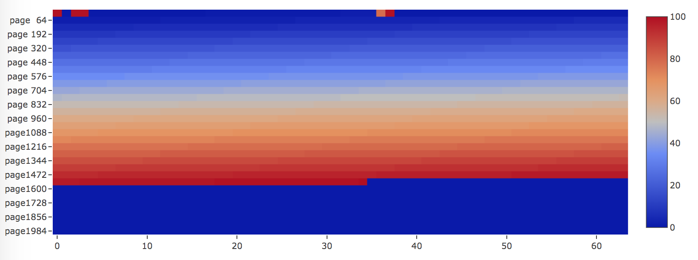
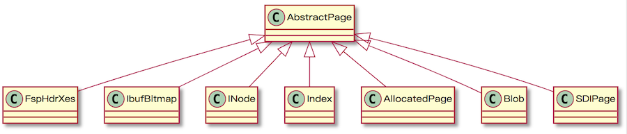
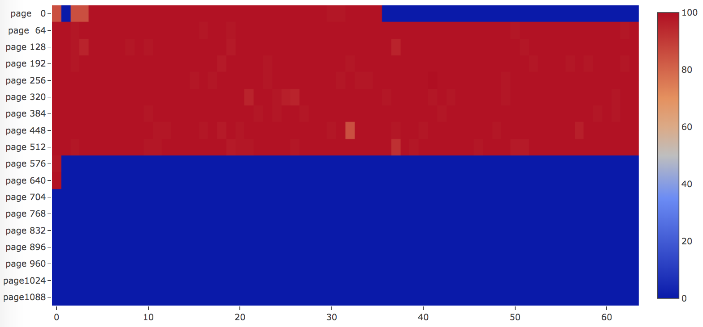
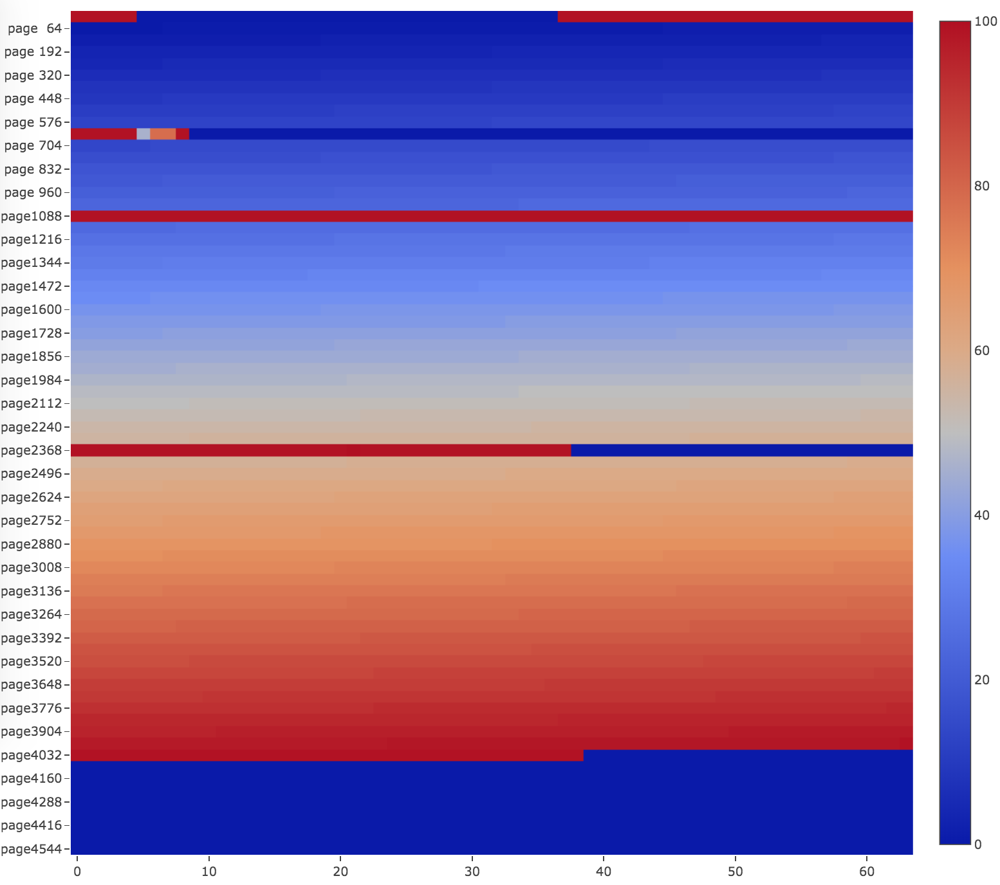

# MySQL InnoDB Java Reader

[](https://travis-ci.org/alibaba/innodb-java-reader)
[](https://codecov.io/gh/alibaba/innodb-java-reader)
[](https://maven-badges.herokuapp.com/maven-central/com.alibaba/innodb-java-reader)
[](https://github.com/alibaba/druid/releases)
[](https://javadoc.io/doc/com.alibaba/innodb-java-reader)
[](http://www.apache.org/licenses/LICENSE-2.0)

innodb-java-reader is a java implementation to access MySQL InnoDB storage engine file directly. With the library or command-line tool, it provides some basic read-only features like examining pages, looking up record by primary key and generating page heatmap by LSN or filling rate. This project is useful for prototyping and learning MySQL. Moreover, this can be a tool to dump table data by offloading from MySQL process under some conditions.

[1. Background](#1-background)

[2. Prerequisites](#2-prerequisites)

[3. Features](#3-features)

[4. Quick Start](#4-quickstart)

[5. API usage](#5-api-usage)

[6. Command-line tool](#6-command-line-tool)

[7. Building](#7-building)

[8. Future works](#8-future-works)

## 1. Background

InnoDB is a general-purpose storage engine that balances high reliability and high performance in MySQL, since 5.6 InnoDB has become the default MySQL storage engine.

Everybody knows MySQL is a row oriented OLTP database with B+ tree clustered index to store records. In Alibaba, I encountered one MySQL performance issue, and this led me to deep dive into InnoDB internal mechanism, but it turned out to be hard since the source code is too complex to know every detail. There are few internal documentations either.

To better understand how InnoDB stores data, I introduce the project for prototyping, and I choose Java language to implement because it is widely used and more understandable. Some of the works are inspired by [Jeremy Cole](https://blog.jcole.us/)'s blog about InnoDB, which helps me a lot, many thanks to Jcole.

## 2. Prerequisites

* Java 8 or later version.
* MySQL 5.6, 5.7 or 8.0 (partially supported).
* Make sure [InnoDB row format](https://dev.mysql.com/doc/refman/5.7/en/innodb-row-format.html) is either `COMPACT` or `DYNAMIC`.
* Enable `innodb_file_per_table` , which will create standalone `*.ibd` file for each table.
* InnoDB file page size is set to 16K.
* Be aware that if pages are not flushed from Buffer pool to disk, the result is inconsistent.
* For tables to read, make sure one and only one column primary key is defined. It will not work if MySQL uses the first non-NULL unique key as primary key or a 48-bit hidden Row ID field as primary key. Multiple columns for primary key and secondary index will be supported in the future.

## 3. Features

The row format of a table determines how rows are physically stored, which in turn can affect the performance of queries and DML operations. `innodb-java-reader` supports `COMPACT` or `DYNAMIC` page format and can work smartly to choose the right page format decoder to read pages.

`innodb-java-reader` supports operations like examining pages' information, looking up record by primary key, range querying by primary key, querying records by page number and generating page heatmap & filling rate.

Supported column types are listed below.

| Type | Support column types |
| ---- | -------------------- |
| Numeric | TINYINT, SMALLINT, MEDIUMINT, INT, BIGINT, FLOAT, DOUBLE |       |
| String and Binary | CHAR, VARCHAR, BINARY, VARBINARY, TINYBLOB, BLOB, MEDIUMBLOB, LONGBLOB, TINYTEXT, TEXT, MEDIUMTEXT, LONGTEXT |
| Date and Time | DATETIME, TIMESTAMP, YEAR, DATE                |

## 4. Quickstart

### Dependency

**Maven**

```
<dependency>
  <groupId>com.alibaba</groupId>
  <artifactId>innodb-java-reader</artifactId>
  <version>1.0.0</version>
</dependency>
```

**Gradle**

```
compile "com.alibaba:innodb-java-reader:1.0.0"
```

#### API examples

Here's an example to look up record in a table by primary key.

```
String createTableSql = "CREATE TABLE `tb11`\n" +
        "(`id` int(11) NOT NULL ,\n" +
        "`a` bigint(20) NOT NULL,\n" +
        "`b` varchar(64) NOT NULL,\n" +
        "PRIMARY KEY (`id`))\n" +
        "ENGINE=InnoDB;";
String ibdFilePath = "/usr/local/mysql/data/test/t.ibd";
try (TableReader reader = new TableReader(ibdFilePath, createTableSql)) {
  reader.open();
  GenericRecord record = reader.queryByPrimaryKey(4);
  Object[] values = record.getValues();
  System.out.println(Arrays.asList(values));
}
```

output:
```
[4, 8, dddddddd]
```

More usage you can jump to [API usage](#5-api-usage) section. The best place to better explore is to look at the examples for some common use cases addressed here in [innodb-java-reader-demo](innodb-java-reader-demo/src/main/java/com/alibaba/innodb/java/reader).

#### Command-line examples

Here's an example to range query records in a table by primary key with command-line tool.

Checkout the project and [build](#7-building), use the executable jar under `innodb-java-reader-cli/target`.

`t.ibd` is the InnoDB ibd file path, `t.sql` is where the output of `SHOW CREATE TABLE <table_name>` saved as content. Arguments are the lower bound target key (inclusive) and the upper bound target key (exclusive), separated by comma.

```
java -jar innodb-java-reader-cli.jar -ibd-file-path /usr/local/mysql/data/test/t.ibd -create-table-sql-file-path t.sql -c range-query-by-pk -args "1,3" > output.dat
```
Output shows as below, the result is the same by running `mysql -N -uuser_name -ppassword -e "select * from test.t where id >= and id < 3" > output && cat output | tr "\t" "," > output.dat`.
```
1,2,aaaaaaaa
2,4,bbbbbbbb
```

You can also use `query-all` command to dump the whole table. 

But to be aware that if pages are not flushed from InnoDB Buffer pool to disk, then **the result maybe not consistent**. How long do dirty pages usually stay dirty in memory? That is a tough question, InnoDB leverages WAL in terms of performance, so there is no command available to flush all dirty pages. Only internal mechanism controls when there need pages to flush, like Page Cleaner thread, adaptive flushing, etc.

Here's another example to generate heatmap.

Assume we have a table without secondary index, and the primary key is built by inserting rows in key order. Then run the following command.

```
java -jar innodb-java-reader-cli.jar -ibd-file-path /usr/local/mysql/data/test/t.ibd -create-table-sql-file-path t.sql -c gen-lsn-heatmap -args ./out.html
```

The heatmap shows as below.



The pages are allocated and filled perfectly as color changes from blue (LSN is smallest) to red (LSN is biggest), from the beginning of the file towards to the end.

More usage you can jump to [Command-line tool](#6-command-line-tool) section.


## 5. API usage

You can prepare some data beforehand. All the following examples will be based on a table named `t`.

```
CREATE TABLE `t`
(`id` int(11) NOT NULL,
`a` bigint(20) NOT NULL,
`b` varchar(64) NOT NULL,
PRIMARY KEY (`id`))
ENGINE=InnoDB;

delimiter ;;
drop procedure if EXISTS idata;
create procedure idata()
  begin
    declare i int;
    set i=1;
    while(i<=5)do
      insert into t values(i, i * 2, REPEAT(char(97+((i - 1) % 26)), 8));
      set i=i+1;
    end while;
  end;;
delimiter ;
call idata();
```

After creating and populating the very simple table, there should be 5 rows.

```
mysql> select * from t;
+----+----+----------+
| id | a  | b        |
+----+----+----------+
|  1 |  2 | aaaaaaaa |
|  2 |  4 | bbbbbbbb |
|  3 |  6 | cccccccc |
|  4 |  8 | dddddddd |
|  5 | 10 | eeeeeeee |
+----+----+----------+
```

### 5.1 Setting table schema

Schema must be provided before accessing the table. There are two ways to specify a table schema.

#### Using SQL

Run `SHOW CREATE TABLE` statement in MySQL command-line and copy the output as a string. Inside `innodb-java-reader`, it leverages [JSqlParser](https://github.com/JSQLParser/JSqlParser) and [antlr4](https://github.com/antlr/antlr4) to parse SQL to AST and get the table definition.

For example,
```
String createTableSql = "CREATE TABLE `t`\n" +
        "(`id` int(11) NOT NULL ,\n" +
        "`a` bigint(20) NOT NULL,\n" +
        "`b` varchar(64) NOT NULL,\n" +
        "PRIMARY KEY (`id`))\n" +
        "ENGINE=InnoDB;";
```

#### Using API

Create a `Schema` instance with all `Column`s. `Column` can be created in fluent style by setting the required column `name`, `type`, while there are optional settings for users to specify if a column is `nullable` or not, is `primary key` or not.

For variable-length or fixed-length column types like` VARCHAR`, `VARBINARY`, `CHAR`, column type can be declared with a length that indicates the maximum length you want to store, just like what you define a DDL in MySQL. For integer types, the display width of the integer column will be ignored.

For example,
```
Schema schema = new Schema()
        .addColumn(new Column().setName("id").setType("int(11)").setNullable(false).setPrimaryKey(true))
        .addColumn(new Column().setName("a").setType("bigint(20)").setNullable(false))
        .addColumn(new Column().setName("b").setType("varchar(64)").setNullable(false));
```

### 5.2 Creating TableReader

Thread-safe class `TableReader` enables you to call all the useful APIs.

With try-with-resources statement, you can ensure that IO resource used by `TableReader` is closed at the end of all invocations. By default, `TableReader` leverage **buffer IO**, pages are read from page cache into `DirectByteBuffer` and then copy to heap to manage their lifecycle. This framework is also open for extension to use **mmap** or **direct io**.

There are two constructors, one needs to provide tablespace file `*.ibd` file path and *create table* sql, while the other needs the `*.ibd` file path and schema instance.

For example,

```
String createTableSql = "CREATE TABLE `t`\n" +
        "(`id` int(11) NOT NULL ,\n" +
        "`a` bigint(20) NOT NULL,\n" +
        "`b` varchar(64) NOT NULL,\n" +
        "PRIMARY KEY (`id`))\n" +
        "ENGINE=InnoDB;";
String ibdFilePath = "/usr/local/mysql/data/mydb/t.ibd";
try (TableReader reader = new TableReader(ibdFilePath, createTableSql)) {
  reader.open();
  // API invocation goes here...
}
```

### 5.3 Examining a tablespace file

#### Listing all pages

This will give you a high-level overview about InnoDB file structure, as it results in a list of `AbstractPage`, for example, you can get all contiguous pages of their basic information.

```
try (TableReader reader = new TableReader(ibdFilePath, createTableSql)) {
  reader.open();
  long numOfPages = reader.getNumOfPages();
  List<AbstractPage> pages = reader.readAllPages();
}
```

`AbstractPage` is the parent class of all pages. The page definition can be found in `fil0fil.h`. `innodb-java-reader` supports some of the commonly used page types like FspHdr/Xdes page, insert buffer bitmap page, index page, blob page, SDI page (only in MySQL 8.0 or later) and allocated page (unused page).



`AbstractPage` base class includes 38 bytes `FilHeader` and 8 bytes `FilTrailer` for all page type. The raw byte array body will be extracted accordingly for sub-classes. You can find the APIs regarding how to access the detailed structure for different types under [page](innodb-java-reader/src/main/java/com/alibaba/innodb/java/reader/page) package in Javadoc.

For example, the demo table `t` will result as below.

```
0,FILE_SPACE_HEADER,numPagesUsed=4,size=6,xdes.size=1
1,IBUF_BITMAP
2,INODE,inode.size=2
3,INDEX
4,ALLOCATED
5,ALLOCATED
```

Moreover, `Iterator<AbstractPage> getPageIterator()` is useful to get pages iteratively.

#### Viewing one page

You can query page one by one. For supported page types, you can check the internal information.

```
try (TableReader reader = new TableReader(ibdFilePath, schema)) {
  reader.open();
  AbstractPage page = reader.readPage(3);
}
```

### 5.4 Querying a tablespace file

#### Query all records

This will walk through the B+ tree index in ascending order, you can take it as a full-table scan operation as well. First it locates to the root page of the primary key, and do a depth-first traversal recursively, along the traversal it will collects all the records.

```
try (TableReader reader = new TableReader(ibdFilePath, createTableSql)) {
reader.open();
List<GenericRecord> recordList = reader.queryAll();
  for (GenericRecord record : recordList) {
    Object[] values = record.getValues();
    System.out.println(Arrays.asList(values));
    assert record.getPrimaryKey() == record.get("id");
  }
}
```

output result as blow.

```
[1, 2, aaaaaaaa]
[2, 4, bbbbbbbb]
[3, 6, cccccccc]
[4, 8, dddddddd]
[5, 10, eeeeeeee]
```

GenericRecord represents one row.

- To retrieve a column data through column name, you can invoke `Object get(String columnName)` .
- To retrieve a column data by column index, you can invoke `Object get(int index)` .
- To retrieve the primary key, you can invoke `Object getPrimaryKey()` .

`queryAll` accepts an optional argument `Predicate<Record> ` to filter.

This feature enables you to dump data if data persists in InnoDB file by offloading MySQL.

#### Query by page number

This only works for index page type.

```
try (TableReader reader = new TableReader(ibdFilePath, createTableSql)) {
  reader.open();
  List<GenericRecord> recordList = reader.queryByPageNumber(3);
}
```

For leaf B+ tree page, the result record will be rows of a table.

For non-leaf page in multi-level B+ tree index, the result record will be the primary with all the other columns as `NULL`. You can check whether it is leaf or not and get the child page number in clustered index.

```
if (!record.isLeafRecord()) {
  System.out.println(record.getChildPageNumber());
}
```

#### Query by primary key

B+ tree is an efficient data structure to do point and range query, it requires limited number of disk IO operations even for a very large table since the depth of the tree is usually not very big, that is why B+ tree scales nicely.

To look up record by primary key, innodb-java-reader will start from the root page in clustered index and do point-query in B+ tree index.

If the page is leaf, then it will do binary search in page directory slots to locate the nearest record (the highest key that smaller than the target key, `innodb-java-reader` leverages [search-insertion-position for sorted array](https://leetcode.com/problems/search-insert-position/) algorithm to do that), and walk through the records one by one as they are singly linked in one page until the target value found or return null if not present.

For non-leaf page, the record is simply the child page number, so `innodb-java-reader` will go deeper in the multiple-level B+ tree to the child page and run recursively.

```
try (TableReader reader = new TableReader(ibdFilePath, createTableSql)) {
  reader.open();
  GenericRecord record = reader.queryByPrimaryKey(4);
  Object[] values = record.getValues();
  System.out.println(Arrays.asList(values));
  assert record.getPrimaryKey() == record.get("id");
  System.out.println("id=" + record.get("id"));
  System.out.println("a=" + record.get("a"));
}
```

Note that in MySQL 5.7 or earlier version, usually page 3 will be the root page of the clustered index, page 4 will be the root of the first secondary key, etc. After MySQL 8.0 or later, page 3 is usually the SDI page with data dictionary, and root page will usually go next to page 4. `innodb-java-reader` assumes the root page is either page 3 or 4 and can work smartly to determine where to start.

#### Range query by primary key

`rangeQueryByPrimaryKey` method requires 2 arguments, the left is the lower bound target key (inclusive), the right is the upper bound target key (exclusive).

MySQL InnoDB engine will have its own way to execute a range query, here in innodb-java-reader, it will use a naive and simple way: go deep into the leaf node of B+ tree index, and visit page by page, record by record, the algorithm looks like below:

1. Lookup the record greater than or equal to the lower bound target key.
2. Lookup the record smaller than the upper bound target key.
3. Start from the record found in step 1, go ahead by the singly linked record pointer to visit each record next until `SUPREMUM` record found, which mean the end of the page has met.
4. There are pointers stored in the `FilHeader`, point to the logical previous and next page. Go to the next page and query all records from the `INFINIMUM` record. Repeat the process in step 3. If the page is where the record smaller than the upper bound target key resides, then it will compare record read with the target end key, so that we can exit nicely.

For example, the lower and upper bound target key can be `null`, which means the limit is not specified in this direction.

```
try (TableReader reader = new TableReader(ibdFilePath, createTableSql)) {
  reader.open();
  List<GenericRecord> recordList = reader.rangeQueryByPrimaryKey(0, 5);
  recordList = reader.rangeQueryByPrimaryKey(null, null);
  recordList = reader.rangeQueryByPrimaryKey(5, null);
}
```

`rangeQueryByPrimaryKey` accepts an optional argument `Predicate<Record> ` to filter.

#### Iterator pattern

For extremely large tablespace, querying like `queryAll` or `rangeQueryByPrimaryKey` would cause out of memory error since data cannot fit into memory. The iterator pattern will help you out, it will load page by page until you really visit these records.

For example, `getQueryAllIterator` will return an iterator to visit all records.

```
try (TableReader reader = new TableReader(ibdFilePath, createTableSql)) {
  reader.open();
  Iterator<GenericRecord> iterator = reader.getQueryAllIterator();
  int count = 0;
  while (iterator.hasNext()) {
    GenericRecord record = iterator.next();
    Object[] values = record.getValues();
    System.out.println(Arrays.asList(values));
    count++;
  }
  System.out.println(count);
}
```

For example, `getRangeQueryIterator` will return an iterator to visit targeted records based on the lower and upper bound just like what ``rangeQueryByPrimaryKey`` does.

```
try (TableReader reader = new TableReader(ibdFilePath, createTableSql)) {
  reader.open();
  Iterator<GenericRecord> iterator = reader.getRangeQueryIterator(1, 10);
  while (iterator.hasNext()) {
    GenericRecord record = iterator.next();
    Object[] values = record.getValues();
    System.out.println(Arrays.asList(values));
  }
}
```

## 6 Command-line tool

### 6.1 Usage

Checkout the project and [build](http://gitlab.alibaba-inc.com/xu.zx/innodb-java-reader#7-building), use the executable jar under `innodb-java-reader-cli/target`. Usage shows as below.

````
usage: java -jar innodb-java-reader-cli.jar [-args <arg>] [-c <arg>] [-h]
       [-i <arg>] [-json] [-jsonpretty] [-s <arg>]
 -args <arg>                             arguments
 -c,--command <arg>                      mandatory. command to run, valid
                                         commands are:
                                         show-all-pages,show-pages,query-b
                                         y-page-number,query-by-pk,query-a
                                         ll,range-query-by-pk,gen-lsn-heat
                                         map,gen-filling-rate-heatmap,get-
                                         all-index-page-filling-rate
 -h,--help                               usage
 -i,--ibd-file-path <arg>                mandatory. innodb file path with
                                         suffix of .ibd
 -json,--json-style                      set to true if you would like to
                                         show page info in json format
                                         style
 -jsonpretty,--json-pretty-style         set to true if you would like to
                                         show page info in json pretty
                                         format style
 -s,--create-table-sql-file-path <arg>   create table sql file path by
                                         running SHOW CREATE TABLE
                                         <table_name>
````

You can customize log4j configuration by adding `-Dlog4j.configuration=file:/path/log4j.properties` in command.

### 6.2 Examples

#### Listing all pages

```
java -jar innodb-java-reader-cli.jar -ibd-file-path /usr/local/mysql/data/test/t.ibd -create-table-sql-file-path t.sql -c show-all-pages
```

Output:

```
=====page number, page type, other info=====
0,FILE_SPACE_HEADER,space=141,numPagesUsed=4,size=6,xdes.size=1
1,IBUF_BITMAP
2,INODE,inode.size=2
3,INDEX,root.page=true,index.id=176,level=0,numOfRecs=5,num.dir.slot=2,garbage.space=0
4,ALLOCATED
5,ALLOCATED
```

#### Examining some pages

Arguments are page numbers, separated by comma.

```
java -jar innodb-java-reader-cli.jar -ibd-file-path /usr/local/mysql/data/test/t.ibd -create-table-sql-file-path t.sql -c show-pages -args "3,4,5"
```

`ToString` method will be invoked for every page examined and print on console. You can add `--json-style` or `--json-pretty-style` to print out information in more human readable way.

#### Querying all records

```
java -jar innodb-java-reader-cli.jar -ibd-file-path /usr/local/mysql/data/test/t.ibd -create-table-sql-file-path t.sql -c query-all
```

Output:

```
[1, 2, aaaaaaaa]
[2, 4, bbbbbbbb]
[3, 6, cccccccc]
[4, 8, dddddddd]
[5, 10, eeeeeeee]
```

#### Querying by page number

Argument is page number, only index page type is supported.

```
java -jar innodb-java-reader-cli.jar -ibd-file-path /usr/local/mysql/data/test/t.ibd -create-table-sql-file-path t.sql -c query-by-page-number -args 3
```

 #### Querying by primary key

Argument is the target key.

```
java -jar innodb-java-reader-cli.jar -ibd-file-path /usr/local/mysql/data/test/t.ibd -create-table-sql-file-path t.sql -c query-by-pk -args 5
```

#### Range querying by primary key

Arguments are the lower bound target key (inclusive) and the upper bound target key (exclusive), separated by comma.

```
java -jar innodb-java-reader-cli.jar -ibd-file-path /usr/local/mysql/data/test/t.ibd -create-table-sql-file-path t.sql -c range-query-by-pk -args "1,3"
```

#### Dump data

You can use command-line tool to dump data, but dirty pages might not be flushed to disk, so the data consistency is what you must consider. You can dump records by `query-all` or `range-query-by-pk` like below.

```
java -jar innodb-java-reader-cli.jar -ibd-file-path /usr/local/mysql/data/test/t.ibd -create-table-sql-file-path t.sql -c query-all > output.dat
```

The `output.dat` file contains record per line with comma delimited for columns. The result is the same with the following command output.

```
mysql -N -uuser_name -ppassword -e "select * from test.t" > output && cat output | tr "\t" "," > output.dat
```

#### Generating LSN heatmap

Arguments are the output html file path, the heatmap width and height.

```
java -jar innodb-java-reader-cli.jar -ibd-file-path /usr/local/mysql/data/test/t.ibd -create-table-sql-file-path t.sql -c gen-lsn-heatmap -args "./out.html 800 1000"
```

Here is an example if we have a table with random primary key insertion order. Then many pages will be revisited, as illustrated in the image below, most of the pages are "red" colored, which means those pages LSN are close to each other.



Another example will be a table with two indices, one is primary key built by inserting rows in key order, the other is a secondary key with random insertion order. As you can see, the primary key index is written to in ascending order as they are visited from the beginning of the file until the end. Pages of the secondary keys are "red" colored, which means those pages LSN are close to each other.



#### Generating filling rate heatmap

Arguments are the output html file path, the heatmap width and height.

```
java -jar innodb-java-reader-cli.jar -ibd-file-path /usr/local/mysql/data/test/t.ibd -create-table-sql-file-path t.sql -c gen-filling-rate-heatmap -args "./out.html 800 1000"
```

Filling rate, also known as page filling factor, means how efficient for InnoDB to make use of storage space. InnoDB store records in row-oriented layout, usually this is good for OLTP scenario. While in big data industry, columnar storage format is more preferred, because for performance, it can read required data, skip unnecessary deserialization, leverage specific encoding and better for compression, so the storage space is much more saved. Although, row-oriented format is not friendly in term of file size, we still want to know the space occupied by data, InnoDB file can be fragmented due to logical deletion or B+ tree splitting. Filling rate for every page is calculated by examining `used space / page size`, used space equals to `heap_top_position + page_directory_slots_bytes + FilTrailer - garbage_space`. This is different from `data_free` value when you examine a table through `information_schema.TABLES`, `data_free` means the space allocated on disk for, but not used.

Assume we build a table by inserting rows in sequential order. The page filling rate will be more than 90 percent initially.


After deleting some rows. Looking at the filling rate heatmap, we can see some pages are fragmented and the filling rate drops dramatically.


After `OPTIMIZED TABLE <T>`, the table filling rate will go back to more than 90 percent.


#### Get all index page filling rate

```
java -jar innodb-java-reader-cli.jar -ibd-file-path /usr/local/mysql/data/test/t.ibd -create-table-sql-file-path t.sql -c get-all-index-page-filling-rate
```

## 7 Building

`innodb-java-reader` is a standard Maven project. Simply run the following command from the project root directory, make sure all unit testcases are passed.

```
mvn clean install
```

## 8 Future works

* Support more commonly used data types including DECIMAL, YEAR, TIME, DATE, etc.
* Support MySQL 8.0 newly introduced LOB page.
* Support multiple columns primary key and default 6 bytes ROW ID if no primary key is defined by user.
* Look up and range query by secondary key.
* Load table metadata from system tablespace.
* Make innodb-java-reader more SQL-like, in other words, DML operations can be expressed in SQL language, the library can work as a prototype to do some simple optimization and generate the physical execution plan, then it will leverage the reader APIs to read tablespace.
