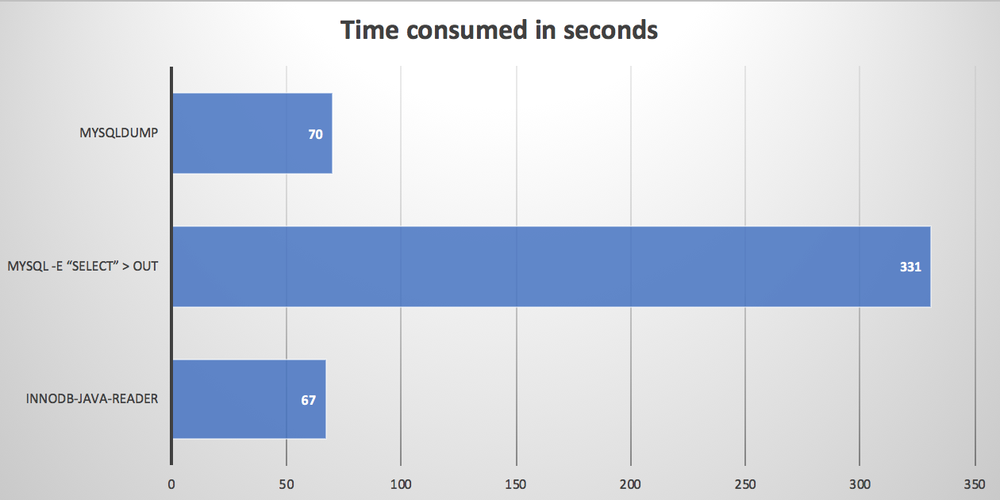

# Benchmark

## Test environment

System:

```
MacBook Pro (Retina, 15-inch, Mid 2015)
CPU: 2.2 GHz Intel Core i7
MEM: 16 GB 1600 MHz DDR3
DISK: APPLE SSD SM0256G (Approximately sequential read 350MB/s)
```

MySQL:

```
version: 5.6.39

+-------------------------------------+----------------+
| Variable_name                       | Value          |
+-------------------------------------+----------------+
| innodb_buffer_pool_dump_at_shutdown | OFF            |
| innodb_buffer_pool_dump_now         | OFF            |
| innodb_buffer_pool_filename         | ib_buffer_pool |
| innodb_buffer_pool_instances        | 8              |
| innodb_buffer_pool_load_abort       | OFF            |
| innodb_buffer_pool_load_at_startup  | OFF            |
| innodb_buffer_pool_load_now         | OFF            |
| innodb_buffer_pool_size             | 134217728      |
| innodb_random_read_ahead            | OFF            |
+-------------------------------------+----------------+
```

## Test data

Table DDL:

```
CREATE TABLE `t` (
  `id` bigint(20) NOT NULL,
  `c1` bigint(20) DEFAULT '0',
  `c2` int(11) DEFAULT '0',
  `c3` varchar(1024) NOT NULL,
  `c4` int(11) NOT NULL DEFAULT '0',
  `c5` varchar(200) NOT NULL,
  `c6` varchar(1024) NOT NULL,
  `c7` text COMMENT,
  `c8` bigint(20) NOT NULL,
  `c9` bigint(20) NOT NULL,
  `c10` bigint(20) NOT NULL DEFAULT '0',
  `c11` int(11) NOT NULL DEFAULT '0',
  PRIMARY KEY (`id`)
) ENGINE=InnoDB DEFAULT CHARSET=utf8 COMMENT='t'
```


Total rows: **25,000,000**

idb file size: **7,570,718,720 Bytes**

Table is generated randomly, sample row and table status shows as below:

```
mysql> select * from t limit 1\G;
*************************** 1. row ***************************
           id: 0
           c1: 0
           c2: 0
           c3: fCUOadIlmig2Ij6ex1LRiVUPkEXpfxTwFHNZYVTLuTVgYwGG54
           c4: 0
           c5: HLcSpVTUsTqgPhQwaiNd
           c6: http://89TPISN3uCsv13NJDR2WgbXjpelScGbmVPbQy1ES4V5V0oU3JT3yk38PxE37FYtjmfay5XwVuzTXkNJ9KkT1y5OBBCtzsbqmL8Yp
           c7: IjlibvLub42D4NzIbk64
           c8: 0
           c9: 0
          c10: 967416179333214281
          c11: 0


mysql> show table status like 't'\G;
*************************** 1. row ***************************
           Name: t
         Engine: InnoDB
        Version: 10
     Row_format: Compact
           Rows: 23163678
 Avg_row_length: 303
    Data_length: 7036993536
Max_data_length: 0
   Index_length: 0
      Data_free: 7340032
 Auto_increment: NULL
    Create_time: 2019-12-30 22:38:37
    Update_time: NULL
     Check_time: NULL
      Collation: utf8_general_ci
       Checksum: NULL
 Create_options:
        Comment: t
```

## Test case

- 1) Run innodb-java-reader-cli.jar
- 2) mysql -N -uroot -P3306 -e "select * from test.t" > mysql-select-result.out
- 3) mysqldump -uroot test t > mysqldump-result.out

## Test result and conclusion

- 1) 67s
- 2) 331s
- 3) 70s

Innodb-java-reader is as good as mysqldump or even better. Also, it enables you to offload from mysql process.



## Test scripts


```
#!/bin/bash

start_time=$(date +%s)

java -jar /Users/xu/IdeaProjects/innodb-java-reader-ali-github/innodb-java-reader-cli/target/innodb-java-reader-cli.jar \
 -ibd-file-path /usr/local/mysql/data/test/t.ibd \
 -create-table-sql-file-path t.sql \
 -c query-all -o innodb-java-reader-result.out

end_time=$(date +%s)
cost_time=$[ $end_time-$start_time ]
echo "elapsed ${cost_time}s"

md5 innodb-java-reader-result.out
```

```
#!/bin/bash

start_time=$(date +%s)

mysql -N -uroot -P3306 -e "select * from test.t" > mysql-select-result.out

end_time=$(date +%s)
cost_time=$[ $end_time-$start_time ]
echo "elapsed ${cost_time}s"

md5 mysql-select-result.out
```

```
#!/bin/bash

start_time=$(date +%s)

mysqldump -uroot test t > mysqldump-result.out

end_time=$(date +%s)
cost_time=$[ $end_time-$start_time ]
echo "elapsed ${cost_time}s"

md5 mysqldump-result.out
```