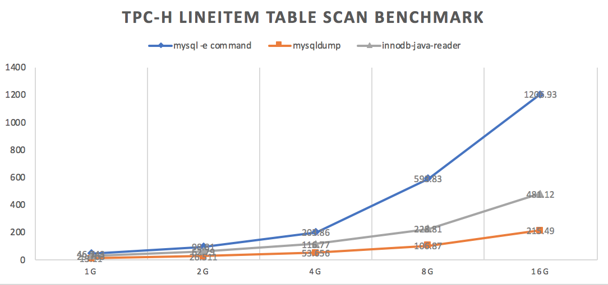

# Benchmark

## Test environment

System:

```
MacBook Pro (Retina, 15-inch, Mid 2015)
CPU: 2.2 GHz Intel Core i7
MEM: 16 GB 1600 MHz DDR3
DISK: APPLE SSD SM0256G (Approximately sequential read 350MB/s)
```

MySQL:

```
version: 5.6.39

+-------------------------------------+----------------+
| Variable_name                       | Value          |
+-------------------------------------+----------------+
| innodb_buffer_pool_dump_at_shutdown | OFF            |
| innodb_buffer_pool_dump_now         | OFF            |
| innodb_buffer_pool_filename         | ib_buffer_pool |
| innodb_buffer_pool_instances        | 8              |
| innodb_buffer_pool_load_abort       | OFF            |
| innodb_buffer_pool_load_at_startup  | OFF            |
| innodb_buffer_pool_load_now         | OFF            |
| innodb_buffer_pool_size             | 134217728      |
| innodb_random_read_ahead            | OFF            |
+-------------------------------------+----------------+
```

Clean page cache before each run. 
```
sync && sudo purge
```

## Test case

innodb-java-reader-cli
```
java -jar -Dinnodb.java.reader.enable.trim.char=true -server -Xms2g -Xmx2G \
  -XX:+UseConcMarkSweepGC -XX:+UseParNewGC innodb-java-reader-cli.jar \
  -ibd-file-path /usr/local/mysql/data/tpch/LINEITEM.ibd \
  -create-table-sql-file-path mysqldump_tpch.sql \
  -c query-all -o lineitem.dat
```

mysql -e command
```
mysql -N -uroot -P3306 -e "select * from tpch.lineitem" > mysql-select-result.out
```

mysqldump
```
mysqldump -uroot tpch lineitem > mysqldump-result.out
```

## TPC-H benchmark

Test against `LINEITEM` table, data are generated by running `dbgen -s size`, size will be 1G to 16G.


|                         | 1G        | 2G         | 4G         | 8G         | 16G         |
| ----------------------- | --------- | ---------- | ---------- | ---------- | ----------- |
| line number             | 6001215   | 11997996   | 23996604   | 47989007   | 95988640    |
| lineite.tbl file length | 759863287 | 1532344491 | 3085874988 | 6210377564 | 12509214305 |
| lineite.ibd file length | 943718400 | 1879048192 | 3745513472 | 7486832640 | 14965276672 |

Test result in seconds.

|                    | 1G     | 2G     | 4G     | 8G     | 16G     |
| ------------------ | ------ | ------ | ------ | ------ | ------- |
| mysql -e command   | 46.743 | 98.81  | 203.86 | 593.83 | 1206.93 |
| mysqldump          | 13.11  | 26.511 | 53.656 | 106.87 | 215.49  |
| innodb-java-reader | 57.763 | 62.79  | 116.77 | 228.81 | 481.12  |



## Realcase benchmark

Table:
```
CREATE TABLE `t` (
  `id` bigint(20) NOT NULL,
  `c1` bigint(20) DEFAULT '0',
  `c2` int(11) DEFAULT '0',
  `c3` varchar(1024) NOT NULL,
  `c4` int(11) NOT NULL DEFAULT '0',
  `c5` varchar(200) NOT NULL,
  `c6` varchar(1024) NOT NULL,
  `c7` text COMMENT,
  `c8` bigint(20) NOT NULL,
  `c9` bigint(20) NOT NULL,
  `c10` bigint(20) NOT NULL DEFAULT '0',
  `c11` int(11) NOT NULL DEFAULT '0',
  PRIMARY KEY (`id`)
) ENGINE=InnoDB DEFAULT CHARSET=utf8 COMMENT='t'
```

Total rows: **25,000,000**

idb file size: **7,570,718,720 Bytes**

Table is generated randomly, sample row and table status shows as below:

```
mysql> select * from t limit 1\G;
*************************** 1. row ***************************
           id: 0
           c1: 0
           c2: 0
           c3: fCUOadIlmig2Ij6ex1LRiVUPkEXpfxTwFHNZYVTLuTVgYwGG54
           c4: 0
           c5: HLcSpVTUsTqgPhQwaiNd
           c6: http://89TPISN3uCsv13NJDR2WgbXjpelScGbmVPbQy1ES4V5V0oU3JT3yk38PxE37FYtjmfay5XwVuzTXkNJ9KkT1y5OBBCtzsbqmL8Yp
           c7: IjlibvLub42D4NzIbk64
           c8: 0
           c9: 0
          c10: 967416179333214281
          c11: 0


mysql> show table status like 't'\G;
*************************** 1. row ***************************
           Name: t
         Engine: InnoDB
        Version: 10
     Row_format: Compact
           Rows: 23163678
 Avg_row_length: 303
    Data_length: 7036993536
Max_data_length: 0
   Index_length: 0
      Data_free: 7340032
 Auto_increment: NULL
    Create_time: 2019-12-30 22:38:37
    Update_time: NULL
     Check_time: NULL
      Collation: utf8_general_ci
       Checksum: NULL
 Create_options:
        Comment: t
```

For commonly used column types, innodb-java-reader is as good as mysqldump or even better. Also, it enables you to offload from mysql process.

